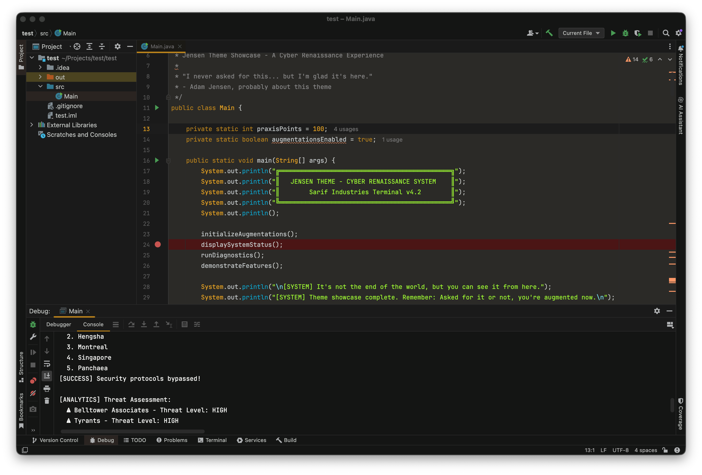

    

Jensen is a theme inspired from the awesome video
game [Deus Ex Human Revolution](https://youtu.be/0af2wvSdwwI)

Bring your machine into the Cyber Renaissance with these gold and copper tones.

## Color scheme

| Palette    | Hex       | RGB           | HSL            |
|------------|-----------|---------------|----------------|
| Background | `#141514` | `40 42 54`    | `231° 15% 18%` |
| Foreground | `#FBFBFB` | `248 248 242` | `60° 30% 96%`  |
| Comment    | `#C4C7C4` | `196 199 196` | `120 3% 77%`   |
| Green      | `#A0FF33` | `160 255 51`  | `88 100% 60%`  |
| Blue       | `#0EA2C9` | `14 162 201`  | `193 87% 42%`  |
| Red        | `#F25244` | `237 51 60`   | `357 84% 56%`  |
| Yellow     | `#EDA622` | `237 166 34`  | `39 85% 53%`   |

## Apps

- [IntelliJ IDEA](./intellij)
- [iTerm](./iTerm)
- [Terminal.app](./terminal)
- VS Code (coming soon)
- [Firefox Theme](./firefox)
- [CSS Theme](./css)

## Fork and get involved

If you like this theme or think it needs a tweak here or there, please get involved.

Play around with the theme on [Themer.dev](https://themer.dev/?colors.dark.shade0=%23141514&colors.dark.shade7=%23FBFBFB&colors.dark.accent0=%23F25244&colors.dark.accent3=%23f48d4f&colors.dark.accent4=%23EDA622&colors.dark.accent1=%23A0FF33&colors.dark.accent2=%230EA2C9&colors.dark.accent5=%23C4C7C4&colors.dark.accent7=%23E8B456&colors.dark.accent6=%23EDA622&activeColorSet=dark)

## Thanks

- [Themer.dev](https://themer.dev) for their awesome tool
- [Eidos interactive](https://www.eidosmontreal.com/games/deus-ex-human-revolution/) for making an
  outstanding game
- [Dracula organisation](https://draculatheme.com/) for inspiring me to make a dark theme
- [Eric Bellefeuille](https://www.behance.net/gallery/2465641/Deus-Ex-Human-Revolution-User-Interface/modules/18399319)

## License

[MIT License](./LICENSE)

*"I never asked for this..."*
